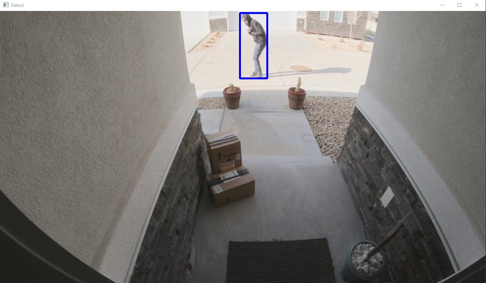

## Detecção de Objetos Utilizando YOLO e OpenCV

O código utiliza as bibliotecas **YOLO** e **OpenCV** com o objetivo de detectar objetos em vídeos. **YOLO** (You Only Look Once) é um modelo de rede neural convolucional extremamente eficiente para detecção de objetos em tempo real. Ele é capaz de identificar múltiplos objetos em uma única passagem pela imagem, sendo mais rápido do que outros métodos tradicionais de detecção.

**OpenCV** (Open Source Computer Vision Library) é uma biblioteca amplamente utilizada para processamento de imagens e vídeos. Ela fornece diversas ferramentas para trabalhar com imagens, detectar objetos, realizar transformações e aplicar técnicas avançadas de visão computacional.

O código tem o intuito de identificar e classificar objetos em vídeos em tempo real, utilizando a detecção de objetos do YOLO, e o processamento de vídeo do OpenCV para analisar e marcar os objetos encontrados nas imagens.

